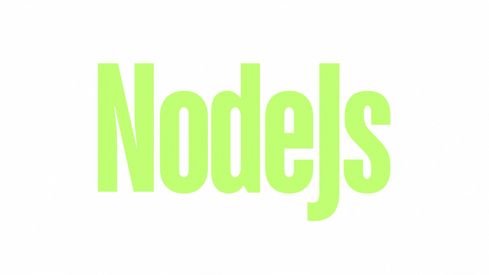

# Unit Tests in JavaScript

## Overview:
Unit testing is a fundamental practice in software development that involves testing individual components of an application to ensure they function correctly. In JavaScript, unit tests help developers identify bugs early, improve code quality, and facilitate easier maintenance. This overview focuses on three essential tools for unit testing in JavaScript: `Mocha`, `Chai`, and `Sinon`.

## Testing essential tools:

### 1. Mocha
Mocha is a flexible JavaScript test framework that provides a robust environment for running tests. It supports both synchronous and asynchronous testing, making it suitable for Node.js applications and browser-based projects. Mocha's syntax is straightforward, using describe() to group tests and it() to define individual test cases. This structure enhances readability and organization, allowing developers to easily understand the purpose of each test.

#### Key features of Mocha include:
- Asynchronous Testing Support: Mocha handles asynchronous operations gracefully, allowing developers to write tests for functions that involve callbacks, promises, or async/await syntax.
- Customizable Reporting: Mocha offers various reporting options, enabling developers to choose how test results are displayed.
- Integration with Other Libraries: Mocha is designed to work seamlessly with assertion libraries like Chai and mocking libraries like Sinon.

### 2. Chai
Chai is an assertion library that complements Mocha by providing a rich set of assertion styles. It allows developers to write expressive and readable tests using various interfaces, including expect(), should(), and assert(). This flexibility enables developers to choose the style that best fits their coding preferences.

#### Chai's features include:
- Readable Assertions: Chai's syntax makes it easy to express expectations clearly, improving the overall readability of tests.
- Support for Promises: Chai provides built-in support for testing promises, allowing developers to assert on resolved or rejected values.
- Custom Matchers: Developers can create custom matchers to extend Chai's functionality, tailoring assertions to specific needs.

## 3. Sinon
Sinon is a powerful library for creating spies, stubs, and mocks, which are essential for testing functions that interact with external dependencies. It allows developers to monitor function calls, replace implementations, and simulate behaviors without relying on actual implementations.

#### Key functionalities of Sinon include:
- Spies: A spy records information about function calls, such as arguments, return values, and the context in which it was called. This is useful for verifying that functions are called as expected.
- Stubs: A stub is a function that replaces another function, allowing developers to control its behavior and return values. This is particularly useful for isolating tests from external dependencies.
- Mocks: Mocks are similar to stubs but come with built-in expectations about how they should be called. This allows for more rigorous testing of interactions between components.

## Resources:

<ul>
  <li>
    <a href="https://mochajs.org/">Mocha documentation</a>
  </li>
  <li><a href="https://www.chaijs.com/api/">Chai</a></li>
  <li><a href="https://sinonjs.org/">Sinon</a></li>
  <li><a href="https://expressjs.com/en/guide/routing.html">Express</a></li>
  <li><a href="https://www.npmjs.com/package/request">Request</a></li>
  <li><a href="https://www.digitalocean.com/community/tutorials/how-to-test-nodejs-apps-using-mocha-chai-and-sinonjs">How to Test NodeJS Apps using Mocha, Chai and SinonJS</a></li>
</ul>
